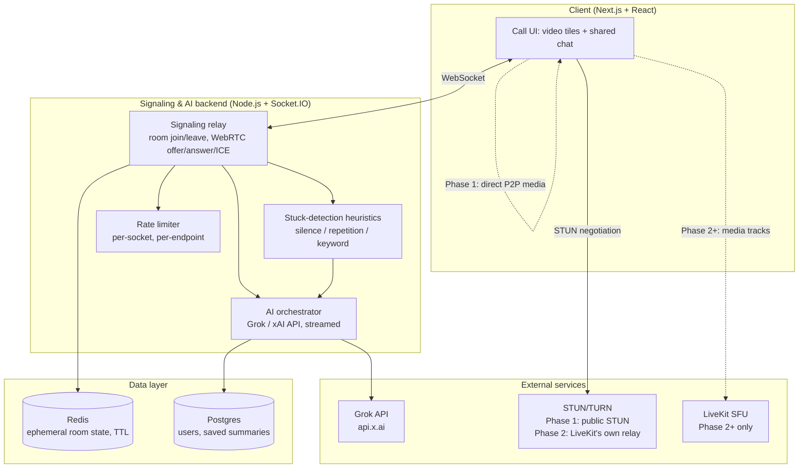

# CoThink — Architecture & Build Spec (Resume-Scale Edition)

> This document is written to be executed, not just read. If you are an AI coding
> agent (Claude Code or similar) picking this up, jump to **Part 4: Build Instructions
> for an AI Agent**. If you are the human owner, read Parts 1–3 first — they explain
> *why* the system is shaped this way, which you'll need in an interview.

## Part 0 — Scope decision (read this first)

This is a deliberately **small-scale, fully-shippable** version of a bigger idea. The
original concept (`build.md`) targeted 80–100 person calls and 5,000 daily users. That
scale is **documented as a cost/capacity case study**, not built. What actually gets
built and deployed is:

- **Built (Phases 1–2):** 1:1 calls via peer-to-peer WebRTC; group calls up to 10
  people via an SFU (LiveKit), capacity-enforced server-side, with manual
  per-track video subscription so only the ~5 most-recently-active speakers get
  a live feed and everyone else is audio-only + avatar. A **shared** AI chat —
  every participant sees the identical streamed response, not a private
  per-user assistant panel — reused unchanged across both call modes.
- **Documented, not yet built (Phases 3–5):** two-stage stuck-detection (cheap
  heuristics gate an expensive LLM judgment call); a save → summarize → delete
  pipeline with an ephemeral-by-default data lifecycle; a load test to
  ~15–20 simulated participants. Specified below so they can be picked up later
  without re-deriving the design.

**Phase 6 (in plan.md, not yet built):** full authentication (Clerk), room ownership
tracking, role-based permissions (admin/moderator/participant), admin controls
(kick, mute, manage permissions), and screen-share capability with permission gating.

**Explicitly not built:** whiteboard sync, session memory across calls, code
collaboration mode, multi-region SFU clusters, Kafka, database sharding. These are
either resume roadmap bullets or belong in the scale case study, not the codebase.

The engineering logic here (SFU track handling, per-track VAD gating, two-stage
judgment pipeline) is the same code whether 10 people are in a room or 100 — what
changes at 100 is infra capacity and cost, not the logic. Proving it at small scale is
legitimate evidence it holds at the larger one.

---

## Part 1 — System overview

**Why media and chat are separate channels:** AI latency must never affect call
quality. The signaling server relays WebRTC negotiation and chat/AI events over
Socket.IO; actual audio/video either flows peer-to-peer (Phase 1) or through the SFU
(Phase 2+) — never through the Node signaling process itself.

---

## Part 2 — Phased build plan

Each phase is a complete, demoable increment. Do not start a phase until the previous
one runs end-to-end.

### Phase 1 — 1:1 call + shared AI chat *(this repo implements this phase)*

- Peer-to-peer WebRTC: `getUserMedia` + `RTCPeerConnection`, signaling relayed over
  Socket.IO, public STUN server for NAT traversal (no TURN needed yet — same-network
  or favorable-NAT testing is fine for a demo).
- Shared AI chat: any participant sends a message → server calls the Grok API with
  `stream: true` → response is forwarded chunk-by-chunk over Socket.IO to **every**
  socket in the room, so both participants watch the same tokens stream in at the
  same time. This is the one product decision worth defending in an interview: it's
  a room-level shared object, not a personal assistant.
- Human-to-human text chat, relayed the same way, for completeness.
- Basic input validation + per-socket rate limiting on the AI chat path.

**Acceptance criteria:** two browser tabs on `localhost`, each with camera access,
can see and hear each other, and both see identical AI responses stream in when
either one messages the AI.

### Phase 2 — Small group calls, up to 10 people *(this repo implements this phase)*

- Media swaps from peer-to-peer to LiveKit; the same Socket.IO server now also
  exposes `GET /livekit-token`, which mints a short-lived LiveKit access token
  **after** checking the room isn't already full via LiveKit's own
  `RoomServiceClient.listParticipants` — the cap is enforced against LiveKit's
  actual state, not a count we track ourselves, so it holds even if a client
  tries to skip the UI and request a token directly.
- Speaker-view: the client connects with `autoSubscribe: false` and manages video
  subscriptions itself — every participant's **audio** is always subscribed (you
  hear the whole room), but only the top 5 most-recently-active remote speakers
  get their **video** track subscribed (`publication.setSubscribed(true/false)`).
  Everyone else renders as an avatar tile until they speak. Active-speaker
  ranking updates on `RoomEvent.ActiveSpeakersChanged`, with an LRU-style swap
  when a quiet tile's speaker becomes active and the visible set is full. This
  is the mechanism that makes large calls survive at all — proven here at up to
  10 people, and the same code path holds at 100 (see Part 5).
- Each participant's audio arrives on the SFU as a **separate track** — this is
  useful for per-participant handling generally, though Phase 4 no longer
  transcribes it (speech-to-text was cut from the project).
- The shared AI chat (Socket.IO `chat:message` / `ai:message` / `ai:chunk`) is
  **unchanged** from Phase 1 — Socket.IO's own room broadcast already scales to
  N sockets, so group calls just ride alongside the LiveKit media connection.
- NAT traversal for Phase 2 uses whatever TURN LiveKit Cloud provides, or none
  if self-hosting `livekit-server --dev` on a local network — a dedicated coturn
  deployment is a scale-case-study concern (Part 5), not required at this size.

**Acceptance criteria:** up to 10 browser tabs joined to the same group room code
can see/hear each other; closing and reopening tabs correctly reassigns which
tiles have live video based on who's currently active; the AI chat behaves
identically to Phase 1.

### Phase 3 — Save → summarize → delete pipeline

- "Save" button triggers: Claude summarizes chat + transcript into structured JSON
  (key points, decisions, action items) → rendered to PDF (Puppeteer/Playwright) →
  uploaded to object storage behind a signed URL → **raw transcript deleted
  immediately after**, only the summary persists.
- Persistent on-screen notice for the full call duration (not a one-time toast).
- Redis TTL auto-expires anything never saved — deletion is the default, not a
  cleanup job.

### Phase 4 — Proactive stuck-detection (no speech-to-text)

**Speech-to-text was cut from the project.** That is a deliberate scope decision,
and it changes what this feature honestly is:

- **Available for free:** *silence*. LiveKit already reports who is speaking via
  `ActiveSpeakersChanged` / `participant.isSpeaking`. The client throttles those
  into a `voice:activity` ping, and the server keeps a single "last time anyone
  spoke" timestamp per room. No audio ever leaves the browser, and there is no
  per-minute transcription cost at all.
- **Available from text:** stuck phrases and repetition in what people *type*.
- **Not available:** circular discussion, repeated points, or "I don't know" in
  *spoken* conversation. Detecting those needs words, and without STT there are none.
- Whichever signal fires, the same two-stage design holds: cheap heuristics gate
  an expensive LLM call, so Grok is only asked to judge the moment when a heuristic
  has already fired — never on every pause.
- The AI interjects into the same shared chat channel from Phase 1, tagged with
  which heuristic triggered it.

Describe this as "the AI notices when the room goes quiet or the chat stalls" —
not "the AI listens to your conversation."

### Phase 5 — Load test

- Two separate things to validate: raw SFU capacity (LiveKit's `lk load-test` CLI)
  and our *own* speaker-view subscription logic (many real browser instances of the
  app, via Chrome's fake media devices). The CLI's synthetic publishers never run
  our client code, so it cannot catch a bug in `useGroupRoom.ts`.
- Record real numbers (connection setup time, AI response latency under load,
  memory/CPU on the signaling server) — these become your resume's verifiable claims.

**Explicitly out of scope for the shipped repo:** whiteboard/Yjs sync, pgvector
session memory, code-collaboration mode. Roadmap bullets only.

---

## Part 3 — Tech stack (this repo)

| Layer | Phases 1–2 (this repo, built) | Phases 3–5 (documented) |
|---|---|---|
| Frontend | Next.js (App Router) + React + TypeScript | unchanged |
| Realtime media | 1:1: native WebRTC (`RTCPeerConnection`), peer-to-peer. Group: `livekit-client`, manual per-track subscription for speaker-view | unchanged |
| NAT traversal | 1:1: public STUN. Group: whatever TURN LiveKit Cloud/self-host provides | dedicated coturn only becomes relevant at the Part 5 scale |
| Signaling + chat | Node.js + Express + Socket.IO, plus `GET /livekit-token` (capacity-checked via `livekit-server-sdk`'s `RoomServiceClient`) | adds judgment-call scanning, save/summary routes |
| AI | Grok (xAI) API, streamed via SSE, called server-side only | unchanged, adds judgment-call prompt |
| Speech-to-text | **cut from the project** | **cut** — Phase 4 uses silence + text heuristics instead |
| Ephemeral state | in-memory (this repo) | Redis with TTL (Phase 3+) |
| Persistent data | none yet | Postgres (Phase 3+) |
| PDF generation | none yet | Puppeteer/Playwright (Phase 3) |
| Deployment | local only | Vercel (frontend) + Railway/Fly.io (backend) |

Keeping Phases 1–2 dependency-light (no Redis/Postgres yet) is deliberate — it means
the core interaction (shared streaming AI chat, real speaker-view group calls) is
provable in a weekend, with only two external service signups (Anthropic, LiveKit —
both have free tiers) rather than the full production stack up front.

---

## Part 4 — Build instructions for an AI agent

If you are implementing this, follow these rules exactly:

**Phases 1 and 2 are already built in this repo.** If you're picking this up next,
build Phase 3 (save → summarize → delete) — don't redo 1–2, and don't skip ahead to
4 or 5 before 3 is solid, per the "each phase is a complete, demoable increment"
rule in Part 2.

1. **Match scope to the phase you're building.** Don't add Redis/Postgres while
   working on Phase 3 unless that phase specifically calls for it — each phase
   should stay independently verifiable.
2. **Two workspaces:** `/server` (plain Node.js, CommonJS, no build step — it must
   run with `node server.js`) and `/web` (Next.js + TypeScript).
3. **API keys never reach the client.** Claude and LiveKit server-side calls happen
   only in `/server`. The frontend only ever talks to `/server` (Socket.IO for
   chat/AI/1:1 signaling, `GET /livekit-token` for group calls).
4. **Event/route contract already implemented — extend, don't rename:**
   - `room:join` `{ roomId, name }` → server adds socket to room, broadcasts
     `room:peer-joined` to others in room
   - `webrtc:offer` / `webrtc:answer` / `webrtc:ice-candidate` `{ roomId, payload }`
     → relayed verbatim (Phase 1's 1:1 mesh only; group calls don't use this)
   - `chat:message` `{ roomId, sender, text }` → relayed to all sockets in room
   - `ai:message` `{ roomId, sender, text }` → server calls Claude with
     `stream: true`; forwards `ai:chunk` `{ roomId, delta }` to all sockets in room
     as tokens arrive, then `ai:done` `{ roomId }` when the stream ends
   - Rate limit `ai:message` to roughly 1 request per 3 seconds per socket; on
     violation emit `ai:rate-limited` `{ roomId }` instead of calling Claude
   - `GET /livekit-token?roomId&name` → `{ token, url, identity, maxParticipants }`
     on success, `503` if LiveKit env vars are unset, `403` if the room is already
     at `MAX_GROUP_ROOM_SIZE` (10) per `RoomServiceClient.listParticipants`
   - **Phase 3 should add:** a way to persist the chat/AI history already flowing
     through `chat:message`/`ai:done` into a per-room log (in-memory + TTL, per
     Part 3's table), plus a save route that summarizes it, renders a PDF, and
     deletes the raw log — see Part 2's Phase 3 spec for the exact fields expected.
5. **Do not fabricate a working response without real credentials.** If
   the LLM API key is missing, `ai:message` emits `ai:error`, never a mocked
   reply. If `LIVEKIT_API_KEY`/`SECRET`/`URL` are missing, `/livekit-token` returns
   `503`, never a fake token. Hold any new external dependency (Clerk, Redis,
   an object store) to the same standard in Phases 3–5.
6. **Validate and cap input:** reject or truncate `chat:message`/`ai:message` text
   over ~2,000 characters server-side before it touches any API call.
7. **Match the design tokens** in `web/app/globals.css` — do not introduce a generic
   SaaS-card look (rounded cards + soft grey shadow + gradient wash). The AI's chat
   bubbles and the human's chat bubbles must be visually distinct colors, since the
   AI is a peer in the room, not a system message.
8. **When done, verify:** `npm install` succeeds in both workspaces, `next build`
   succeeds in `/web` with no type errors, and `node server.js` boots without
   throwing (missing `.env` should warn, not crash).

---

## Part 5 — The scale case study (documented, not built)

This section is the artifact referenced in interviews as "designed and cost-modeled
for 80–100 person calls at 5,000 daily users." Keep the numbers below as-is when
citing them — they came from an explicit cost-modeling exercise, not a guess.

**The math that drives every decision below:**
- Avg session ≈ 55 people, 1 hour → ≈ 91 sessions/day → **≈ 300,000
  participant-minutes/day** (≈ 9M/month) of WebRTC connection time. This is why
  media cost, not app-server compute, dominates at this scale.
- Peak concurrency target: **~1,500 concurrent WebRTC connections**, assuming
  bursty usage across a ~10-hour active window.
- **Why there is no STT line item:** transcription was the single largest projected
  cost at this scale. Naively transcribing every open mic for a full call bills on
  *connection* time × headcount — 100 people × 60 min = 6,000 audio-minutes for one
  session. Gating on per-track voice activity would have cut that roughly **35x**,
  since total actual speech across a room is bounded by meeting length rather than
  multiplied by headcount. The project ultimately cut speech-to-text entirely and
  derives its silence signal from LiveKit's existing speaker events instead, which
  costs nothing. The analysis is kept here because the reasoning — *bill on what's
  actually used, not on what's connected* — is the point, and it's the kind of
  decision worth being able to walk through.

**Architecture deltas at that scale (documented, not implemented here):**
- Self-hosted LiveKit SFU cluster (2–3 nodes) instead of LiveKit Cloud's metered
  billing — at 9M participant-minutes/month, owning the bandwidth is cheaper than
  paying a per-minute markup.
- Video: hard cap of ~9–12 live tiles per client via dominant-speaker switching;
  everyone else audio-only. This is not a "nice to have" — it's what makes an
  80–100 person call function on any real device at all.
- Signaling: 2–4 horizontally-scaled Socket.IO instances behind an L7 load
  balancer with a Redis adapter for cross-instance broadcast.
- Redis: single instance + replica (or small 3-node cluster) — not a distributed
  system, this volume doesn't need one.
- Postgres: single primary + one read replica — no sharding.
- Summarization: map-reduce over rolling chunks during the call, then a final
  summarize-the-summaries pass — a single-shot prompt over an 80-person,
  hour-long transcript won't fit or stay coherent.
- Explicitly not needed at this volume: Kafka/message queues (a lightweight
  Redis-backed job queue like BullMQ covers PDF/summary jobs), database sharding,
  multi-region failover.

---

## Part 6 — Data lifecycle & security notes (carry through every phase)

- Ephemeral by default: nothing is retained unless the user explicitly clicks save.
- On save: transcript → summary → PDF → signed link → **raw transcript deleted
  immediately after**, not on a delayed cleanup job.
- A persistent on-screen transcription notice runs for the full call, not a
  one-time toast — consent needs to stay visible, not just be shown once.
- All AI provider keys live only on the backend; the client never sees them.
- Every endpoint gets input validation and rate limiting, including — especially —
  the AI chat path, which doubles as basic prompt-injection mitigation.
- HTTPS/WSS in any real deployment; WebRTC media is encrypted by default
  (DTLS-SRTP) regardless.
